# ☕ AURELIA COFFEE

**Complete Coffee Shop Management System (Laravel Full Stack Project)**

---

## Table of Contents

1. [Project Introduction](#project-introduction)
2. [Project Objectives](#project-objectives)
3. [Project Scope](#project-scope)
4. [Target Users](#target-users)
5. [System Overview](#system-overview)
6. [Business Context](#business-context)
7. [Main Functional Modules](#main-functional-modules)
8. [Frontend Pages](#frontend-pages)
9. [Backend Admin Pages](#backend-admin-pages)
10. [Authentication Module](#authentication-module)
11. [Homepage Module](#homepage-module)
12. [Menu Module](#menu-module)
13. [Product Detail Module](#product-detail-module)
14. [Product Size Module](#product-size-module)
15. [Cart Module](#cart-module)
16. [Checkout Module](#checkout-module)
17. [Order Module](#order-module)
18. [Booking Module](#booking-module)
19. [Contact Module](#contact-module)
20. [Admin Dashboard Module](#admin-dashboard-module)
21. [Admin Product Management](#admin-product-management)
22. [Admin Product Size Management](#admin-product-size-management)
23. [Admin Order Management](#admin-order-management)
24. [Admin Booking Management](#admin-booking-management)
25. [Admin Contact Management](#admin-contact-management)
26. [Database Design](#database-design)
27. [Table Relationships](#table-relationships)
28. [Detailed Data Dictionary](#detailed-data-dictionary)
29. [System Architecture](#system-architecture)
30. [Request Lifecycle](#request-lifecycle)
31. [Route List](#route-list)
32. [Controllers and Responsibilities](#controllers-and-responsibilities)
33. [Models and Responsibilities](#models-and-responsibilities)
34. [Views and UI Structure](#views-and-ui-structure)
35. [Middleware and Security](#middleware-and-security)
36. [Validation Rules](#validation-rules)
37. [Session and State Management](#session-and-state-management)
38. [Detailed Customer Flow](#detailed-customer-flow)
39. [Detailed Admin Flow](#detailed-admin-flow)
40. [Sequence Diagrams](#sequence-diagrams)
41. [Deep System Flows](#deep-system-flows)
42. [Project Structure](#project-structure)
43. [Installation Guide](#installation-guide)
44. [Local Development Workflow](#local-development-workflow)
45. [Testing Checklist](#testing-checklist)
46. [Known Limitations](#known-limitations)
47. [Future Improvements](#future-improvements)
48. [Conclusion](#conclusion)

---

## Project Introduction

Aurelia Coffee is a full-stack web application developed with Laravel to simulate a real-world coffee shop business environment. The system is designed to support both customer-facing operations and administrator-facing management processes. On the customer side, users can browse products, select sizes, add products to cart, place orders, make table bookings, and send contact messages. On the administrator side, admins can manage products, product sizes, orders, bookings, and customer inquiries.

This project is suitable for:

* graduation projects
* portfolio presentation
* Laravel practice
* database design demonstration
* web application architecture demonstration
* small business system simulation

The project is not only a simple storefront but a structured management system that combines frontend user interaction, backend business logic, persistence with MySQL, and an admin workflow.

---

## Project Objectives

The main objectives of the project are:

1. To build a complete coffee shop web application using Laravel.
2. To apply the MVC architecture in a practical project.
3. To design a relational database for products, orders, bookings, and contacts.
4. To implement cart and checkout logic in a structured way.
5. To provide separate workflows for customers and admins.
6. To simulate realistic ordering and booking processes.
7. To demonstrate CRUD operations for admin management.
8. To provide a scalable foundation for future expansion such as payments, APIs, analytics, and mobile integration.

---

## Project Scope

The scope of Aurelia Coffee includes:

### Customer Scope

* account registration and login
* browsing menu products
* selecting product size
* adding products to cart
* updating cart quantity
* removing items from cart
* placing orders
* viewing order history
* making bookings
* viewing booking information
* sending contact messages

### Admin Scope

* secure admin login
* viewing dashboard summary
* product CRUD
* product size CRUD
* order review and status update
* booking review and booking management
* contact message review

### Technical Scope

* Laravel-based routing
* Blade template rendering
* Eloquent ORM
* session-based cart
* MySQL storage
* CRUD forms and validation
* middleware-based access control

---

## Target Users

### 1. Guest Visitors

Guest visitors can browse public pages such as home, about, services, contact, and menu. Depending on implementation, some actions such as checkout or booking may require login.

### 2. Registered Customers

Registered customers can log in and use personalized features such as:

* cart actions
* checkout
* viewing order history
* creating bookings
* viewing booking history

### 3. Administrators

Administrators manage the core business data and system operations, including:

* products
* sizes
* orders
* bookings
* contact messages

---

## System Overview

Aurelia Coffee combines a storefront and a management backend in one Laravel project.

### Main System Parts

* public website
* customer functions
* admin panel
* database layer
* business logic layer

### Main Business Entities

* users
* admins
* products
* product sizes
* orders
* order items
* bookings
* contacts

### Key Business Processes

* customer ordering
* customer booking
* admin product management
* admin order management
* admin booking management

---

## Business Context

A coffee shop needs more than just a page showing products. It needs workflows for:

* menu presentation
* product variations
* purchase flow
* customer reservation flow
* customer communication
* order tracking
* staff-side management

This project reflects those requirements through structured modules.

---

## Main Functional Modules

The project can be divided into the following major modules:

1. Authentication Module
2. Homepage Module
3. Menu and Product Module
4. Product Size Module
5. Cart Module
6. Checkout Module
7. Order History Module
8. Booking Module
9. Contact Module
10. Admin Dashboard Module
11. Product Management Module
12. Product Size Management Module
13. Order Management Module
14. Booking Management Module
15. Contact Message Management Module

---

## Frontend Pages

The frontend side may include the following pages:

1. Home Page
2. About Page
3. Services Page
4. Menu Page
5. Product Detail Page
6. Cart Page
7. Checkout Page
8. My Orders Page
9. Booking Page
10. My Bookings Page
11. Contact Page
12. Login Page
13. Register Page

### Home Page

Purpose:

* introduce the brand
* show slider/banner
* highlight featured products
* guide users to menu or booking

### About Page

Purpose:

* present the coffee shop story
* explain the concept and brand values

### Services Page

Purpose:

* highlight services such as dine-in, takeaway, reservation, special menu

### Menu Page

Purpose:

* display all available products
* allow browsing by users

### Product Detail Page

Purpose:

* display detailed product information
* allow size selection
* allow direct add-to-cart

### Cart Page

Purpose:

* display selected items
* update quantities
* remove items
* calculate totals

### Checkout Page

Purpose:

* confirm order
* finalize purchase

### My Orders Page

Purpose:

* display user order history

### Booking Page

Purpose:

* allow user to reserve a table

### My Bookings Page

Purpose:

* allow user to review booking data

### Contact Page

Purpose:

* provide communication channel for users

---

## Backend Admin Pages

The admin side may include:

1. Admin Login Page
2. Admin Dashboard
3. Product List Page
4. Add Product Page
5. Edit Product Page
6. Product Size Management Page
7. Order List Page
8. Order Detail Page
9. Booking List Page
10. Contact Message List Page

---

## Authentication Module

The authentication module is responsible for verifying users and granting access to protected routes.

### Functions

* register account
* log in
* log out
* maintain session
* protect routes

### Security Mechanisms

* hashed passwords
* middleware-protected routes
* server-side validation
* session-based authentication

### Typical User Auth Flow

1. user opens register page
2. user submits name, email, password
3. system validates data
4. system hashes password
5. system stores user record
6. user can log in
7. session is created after login

### Typical Admin Auth Flow

1. admin opens admin login page
2. admin submits credentials
3. system validates credentials
4. session or guard is established
5. admin is redirected to dashboard

---

## Homepage Module

The homepage is the landing page of the system.

### Responsibilities

* brand presentation
* call-to-action buttons
* promotional content
* visual engagement
* navigation support

### Possible Elements

* hero slider
* featured drinks
* promotional section
* reservation CTA
* menu CTA
* testimonials
* footer information

---

## Menu Module

The menu module shows products stored in the database.

### Responsibilities

* fetch product data
* render product cards
* show image, name, description, and base information
* link to product detail page

### Typical Data Shown

* product image
* product name
* brief description
* price or starting price

### Backend Logic

* query product list from database
* pass data to Blade template
* optionally paginate or group by category

---

## Product Detail Module

The product detail module expands one product into a detailed view.

### Responsibilities

* display complete product information
* show available sizes
* support add to cart

### Typical Data

* product image
* product name
* description
* available sizes
* size-specific prices

### Benefits

This module improves UX by allowing users to understand the product before purchase.

---

## Product Size Module

This module handles size variations for products.

### Why It Matters

Coffee products often have multiple sizes such as:

* Small
* Medium
* Large

Each size may have a different price.

### Responsibilities

* connect each product to multiple sizes
* show size options on product detail page
* store selected size in order items or cart data

### Example

For a Latte:

* Small = 2.50
* Medium = 3.50
* Large = 4.50

---

## Cart Module

The cart module is one of the core transactional modules.

### Main Functions

* add item to cart
* store selected product data
* store selected size data
* increase quantity
* decrease quantity
* remove item
* calculate subtotal
* calculate total

### Typical Cart Item Structure

```json
{
  "product_id": 1,
  "product_name": "Cappuccino",
  "size_id": 2,
  "size_name": "Medium",
  "price": 3.50,
  "quantity": 2,
  "subtotal": 7.00
}
```

### Cart Storage

Most Laravel projects like this use session storage for cart state.

### Cart Page Responsibilities

* list all items
* show quantity controls
* show per-item subtotal
* show grand total
* provide checkout button

---

## Checkout Module

The checkout module transforms cart data into persistent order data.

### Responsibilities

* validate cart is not empty
* create order record
* create order item records
* calculate total
* clear cart after success

### Order Creation Flow

1. read cart data from session
2. create a new order
3. loop through cart items
4. create order_items records
5. compute total_price
6. save total to orders table
7. clear cart session

### Why This Module Is Important

This module represents the business transaction and is one of the most valuable parts of the project.

---

## Order Module

The order module manages placed customer orders.

### Customer Functions

* view order history
* inspect status
* inspect order details

### Admin Functions

* list all orders
* inspect order details
* update order status

### Typical Order Statuses

* Pending
* Processing
* Completed
* Cancelled

### Order Detail May Include

* order id
* customer
* total price
* status
* date
* list of items
* item quantity
* item size
* item price

---

## Booking Module

The booking module allows users to reserve a table.

### Responsibilities

* display booking form
* validate booking data
* store booking record
* allow admin review

### Typical Booking Inputs

* user
* booking date
* booking time
* number of guests
* note or contact info if implemented

### Example Flow

1. user opens booking page
2. user fills date, time, guests
3. system validates values
4. system stores booking
5. admin sees booking in admin panel

### Business Value

This module makes the project more realistic because coffee shops often need reservation workflows.

---

## Contact Module

The contact module allows visitors or customers to send inquiries.

### Responsibilities

* display contact form
* validate input
* save messages
* allow admin to review submissions

### Typical Inputs

* name
* email
* subject if implemented
* message

### Value

This module demonstrates customer communication support and database-backed message handling.

---

## Admin Dashboard Module

The admin dashboard provides an overview of the system.

### Typical Widgets

* total products
* total orders
* total bookings
* total contact messages
* pending orders count
* recent orders

### Dashboard Purpose

The dashboard acts as the control center of the admin system.

---

## Admin Product Management

This module lets the admin create, read, update, and delete products.

### Create Product

Admin can add:

* name
* description
* image
* base info

### Read Product List

Admin can see all products in a table or grid.

### Update Product

Admin can modify product information.

### Delete Product

Admin can remove products that are no longer sold.

### Importance

This module demonstrates full CRUD capability.

---

## Admin Product Size Management

This module is responsible for size variation management.

### Responsibilities

* add size to product
* edit size
* delete size
* define size-specific price

### Example

Product: Mocha

* Small = 2.80
* Medium = 3.80
* Large = 4.80

This module helps the system support realistic pricing rules.

---

## Admin Order Management

The admin order management module lets admins supervise the purchase flow.

### Responsibilities

* view all orders
* inspect order item details
* update order status
* monitor total value

### Sample Actions

* mark pending order as processing
* mark processing order as completed
* review customer purchases

---

## Admin Booking Management

This module helps admins manage reservation operations.

### Responsibilities

* view bookings
* inspect booking information
* confirm or reject bookings if implemented
* monitor reservation traffic

---

## Admin Contact Management

This module allows admins to view messages sent from the contact form.

### Responsibilities

* view sender name
* view sender email
* read message
* follow up externally if needed

---

## Database Design

This section describes the real database structure of the system.

### Core Database Tables

* users
* admins
* products
* product_sizes
* orders
* order_items
* bookings
* contacts
* cart (if stored in database or present in SQL dump)

---

## Table Relationships

### Main Relationships

* one user can have many orders
* one order can have many order items
* one product can have many sizes
* one product can appear in many order items
* one user can have many bookings

### Relationship Summary

* User → Orders = 1:N
* Order → OrderItems = 1:N
* Product → ProductSizes = 1:N
* Product → OrderItems = 1:N
* User → Bookings = 1:N

---

## Detailed Data Dictionary

### 1. users

Stores registered customer accounts.

| Field      | Type      | Description            |
| ---------- | --------- | ---------------------- |
| id         | bigint    | primary key            |
| name       | string    | customer full name     |
| email      | string    | customer email, unique |
| password   | string    | hashed password        |
| created_at | timestamp | record creation time   |
| updated_at | timestamp | record update time     |

### 2. admins

Stores administrator credentials.

| Field      | Type      | Description                      |
| ---------- | --------- | -------------------------------- |
| id         | bigint    | primary key                      |
| email      | string    | admin email                      |
| password   | string    | hashed or secured admin password |
| created_at | timestamp | record creation time             |
| updated_at | timestamp | record update time               |

### 3. products

Stores coffee product information.

| Field       | Type      | Description          |
| ----------- | --------- | -------------------- |
| id          | bigint    | primary key          |
| name        | string    | product name         |
| description | text      | product description  |
| image       | string    | product image path   |
| created_at  | timestamp | record creation time |
| updated_at  | timestamp | record update time   |

### 4. product_sizes

Stores product size and price data.

| Field      | Type        | Description                             |
| ---------- | ----------- | --------------------------------------- |
| id         | bigint      | primary key                             |
| product_id | foreign key | related product                         |
| size_name  | string      | size label such as Small, Medium, Large |
| price      | decimal     | size-specific price                     |
| created_at | timestamp   | record creation time                    |
| updated_at | timestamp   | record update time                      |

### 5. orders

Stores order headers.

| Field       | Type        | Description                   |
| ----------- | ----------- | ----------------------------- |
| id          | bigint      | primary key                   |
| user_id     | foreign key | customer who placed the order |
| total_price | decimal     | total order amount            |
| status      | string      | order status                  |
| created_at  | timestamp   | order creation time           |
| updated_at  | timestamp   | order update time             |

### 6. order_items

Stores order line items.

| Field      | Type        | Description                                    |
| ---------- | ----------- | ---------------------------------------------- |
| id         | bigint      | primary key                                    |
| order_id   | foreign key | related order                                  |
| product_id | foreign key | product purchased                              |
| size_id    | foreign key | selected size                                  |
| quantity   | integer     | quantity purchased                             |
| price      | decimal     | unit or line price depending on implementation |
| created_at | timestamp   | record creation time                           |
| updated_at | timestamp   | record update time                             |

### 7. bookings

Stores reservation data.

| Field      | Type        | Description          |
| ---------- | ----------- | -------------------- |
| id         | bigint      | primary key          |
| user_id    | foreign key | customer who booked  |
| date       | date        | booking date         |
| time       | time        | booking time         |
| guests     | integer     | number of guests     |
| created_at | timestamp   | record creation time |
| updated_at | timestamp   | record update time   |

### 8. contacts

Stores contact form messages.

| Field      | Type      | Description          |
| ---------- | --------- | -------------------- |
| id         | bigint    | primary key          |
| name       | string    | sender name          |
| email      | string    | sender email         |
| message    | text      | message content      |
| created_at | timestamp | record creation time |
| updated_at | timestamp | record update time   |

### 9. cart

If a cart table exists in the SQL dump, it may be used for persistent cart storage. Otherwise, the cart may be stored in session.

| Field      | Type        | Description          |
| ---------- | ----------- | -------------------- |
| id         | bigint      | primary key          |
| user_id    | foreign key | owner of cart row    |
| product_id | foreign key | related product      |
| size_id    | foreign key | selected size        |
| quantity   | integer     | quantity             |
| created_at | timestamp   | record creation time |
| updated_at | timestamp   | record update time   |

---

## System Architecture

The project follows Laravel MVC architecture.

```text
Client Browser
   ↓
Routes (web.php)
   ↓
Controller Layer
   ↓
Model Layer (Eloquent ORM)
   ↓
Database Layer (MySQL)
   ↓
Response returned to Blade View
```

### Layer Explanation

#### Presentation Layer

This is the user-facing layer rendered through Blade templates.

#### Route Layer

Defines accessible endpoints and maps requests to controllers.

#### Controller Layer

Processes requests, coordinates models, and returns views.

#### Model Layer

Communicates with the database using Eloquent.

#### Database Layer

Stores all persistent data.

---

## Request Lifecycle

A typical request lifecycle in Aurelia Coffee works as follows:

1. User enters a URL or clicks a button.
2. Laravel routes receive the request.
3. The route maps to a controller method.
4. The controller validates input if needed.
5. The controller interacts with one or more models.
6. Models query or update the database.
7. The controller receives the result.
8. The controller returns a Blade view or redirects.
9. The browser displays the final response.

---

## Route List

Below is a conceptual route map. Actual route names may vary depending on implementation.

### Public Routes

* `/` → home page
* `/about` → about page
* `/services` → services page
* `/menu` → menu page
* `/product/{id}` → product detail page
* `/contact` → contact page

### Authentication Routes

* `/login`
* `/register`
* `/logout`

### User-Protected Routes

* `/cart`
* `/cart/add`
* `/cart/update`
* `/cart/remove`
* `/checkout`
* `/orders`
* `/orders/{id}`
* `/booking`
* `/my-bookings`

### Admin Routes

* `/admin`
* `/admin/login`
* `/admin/dashboard`
* `/admin/products`
* `/admin/products/create`
* `/admin/products/{id}/edit`
* `/admin/products/{id}/delete`
* `/admin/product-sizes`
* `/admin/orders`
* `/admin/orders/{id}`
* `/admin/bookings`
* `/admin/contacts`

---

## Controllers and Responsibilities

### ProductController

Responsible for:

* listing products
* showing product details
* possibly managing product CRUD on admin side

### CartController

Responsible for:

* adding products to cart
* updating quantity
* removing items
* displaying cart
* calculating totals

### OrderController

Responsible for:

* checkout handling
* creating orders
* creating order items
* displaying user order history
* displaying order detail

### BookingController

Responsible for:

* showing booking form
* storing bookings
* listing user bookings
* admin booking management

### ContactController

Responsible for:

* showing contact form
* storing contact messages
* displaying admin contact data

### AdminController

Responsible for:

* admin authentication
* dashboard overview
* access to admin system

---

## Models and Responsibilities

### User Model

Represents customer accounts and relationships to orders and bookings.

### Admin Model

Represents administrator accounts.

### Product Model

Represents products and their relationships to sizes and order items.

### ProductSize Model

Represents a product variant and price.

### Order Model

Represents the order header and belongs to a user.

### OrderItem Model

Represents items inside an order.

### Booking Model

Represents a reservation.

### Contact Model

Represents a message submitted from the contact form.

---

## Views and UI Structure

The Blade view structure may include:

* `layouts/app.blade.php`
* `home.blade.php`
* `menu.blade.php`
* `product-detail.blade.php`
* `cart.blade.php`
* `checkout.blade.php`
* `orders/index.blade.php`
* `booking.blade.php`
* `contact.blade.php`
* `admin/dashboard.blade.php`
* `admin/products/index.blade.php`
* `admin/orders/index.blade.php`

The UI can be organized into:

* header/navbar
* content area
* footer
* reusable product cards
* form components
* admin tables

---

## Middleware and Security

The project should use middleware to protect routes and control access.

### Middleware Goals

* prevent unauthorized access
* protect admin routes
* protect user-only actions
* prevent CSRF attacks

### Security Features

* CSRF protection
* password hashing
* session authentication
* input validation
* server-side business rule checking

---

## Validation Rules

Validation is important to protect system integrity.

### Registration Validation

* name required
* email required and unique
* password required
* password length minimum

### Login Validation

* email required
* password required

### Booking Validation

* date required
* time required
* guests must be numeric and positive

### Contact Validation

* name required
* email required and valid
* message required

### Product Validation

* product name required
* description required
* image required if needed

### Product Size Validation

* size name required
* price numeric and positive

### Checkout Validation

* cart must not be empty
* user must be authenticated if required

---

## Session and State Management

The cart is typically session-based.

### Session Uses

* keep logged-in user session
* store cart data
* store flash messages
* preserve temporary state between requests

### Flash Messages

The system may display messages such as:

* product added successfully
* cart updated successfully
* order placed successfully
* booking created successfully

---

## Detailed Customer Flow

### A. Customer Browsing Flow

1. user opens home page
2. user navigates to menu
3. system loads products from database
4. user clicks one product
5. system opens product detail page

### B. Customer Add-to-Cart Flow

1. user selects size
2. user chooses quantity
3. user clicks add to cart
4. system validates selected size and quantity
5. system stores item in session cart
6. user is redirected to cart or remains on page with success message

### C. Customer Cart Update Flow

1. user opens cart page
2. user changes quantity
3. system recalculates subtotal
4. system recalculates total
5. updated cart is saved in session

### D. Customer Checkout Flow

1. user opens checkout
2. system checks cart
3. system creates order
4. system creates order items
5. system calculates and stores total
6. system clears session cart
7. user is redirected to my orders

### E. Customer Booking Flow

1. user opens booking page
2. user submits date, time, guest count
3. system validates data
4. system stores booking
5. user receives success feedback

### F. Customer Contact Flow

1. user opens contact page
2. user fills form
3. system validates input
4. system stores message
5. user receives success feedback

---

## Detailed Admin Flow

### A. Admin Login Flow

1. admin opens admin login page
2. admin submits credentials
3. system verifies credentials
4. admin is redirected to dashboard

### B. Admin Product Management Flow

1. admin opens product list
2. admin clicks create product
3. admin fills form
4. system validates data
5. system stores new product
6. admin can edit or delete later

### C. Admin Product Size Flow

1. admin opens size management for product
2. admin adds size name and price
3. system validates data
4. system stores size
5. size appears under product

### D. Admin Order Flow

1. admin opens order list
2. admin views detail
3. admin updates status
4. system saves status change

### E. Admin Booking Flow

1. admin opens booking list
2. admin reviews bookings
3. admin confirms, updates, or cancels depending on implementation

### F. Admin Contact Flow

1. admin opens contact message list
2. admin reads message
3. admin uses information for follow-up

---

## Sequence Diagrams

### 1. Customer Login Sequence

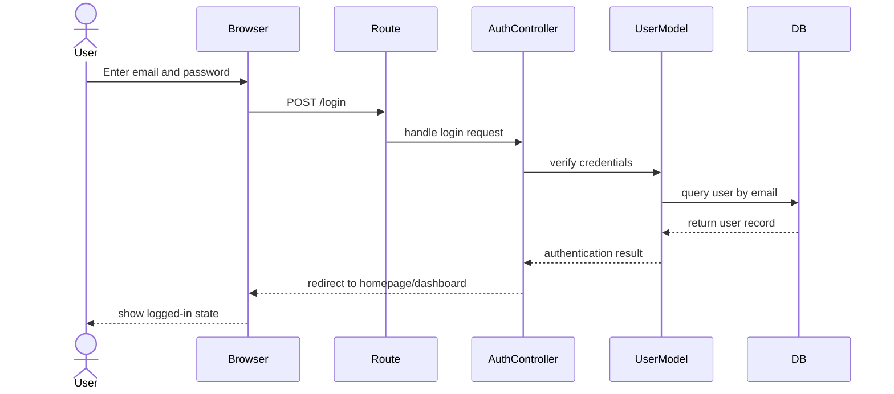

### 2. Add to Cart Sequence

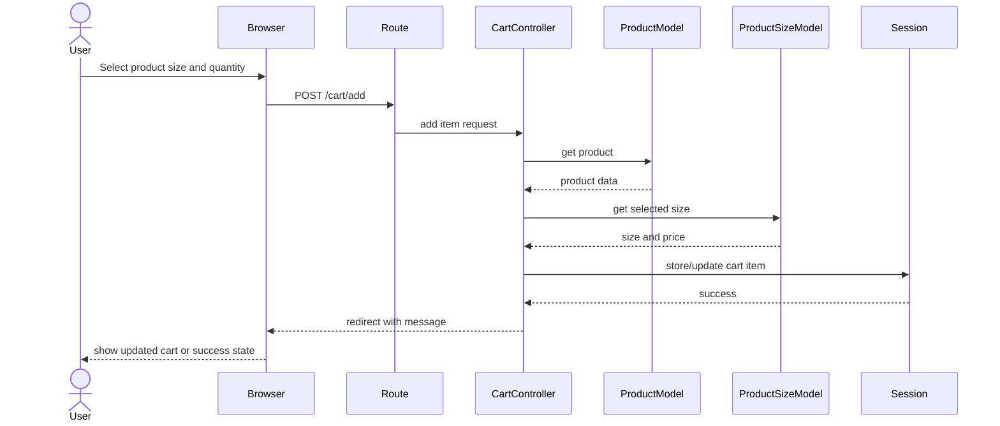

### 3. Checkout Sequence

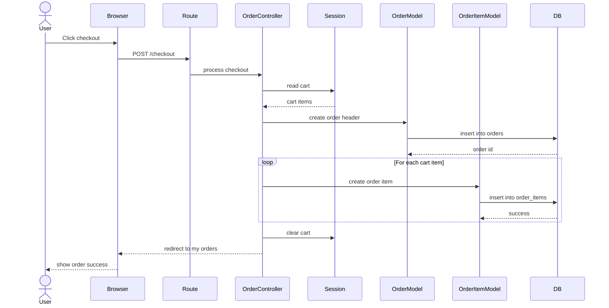

### 4. Booking Sequence

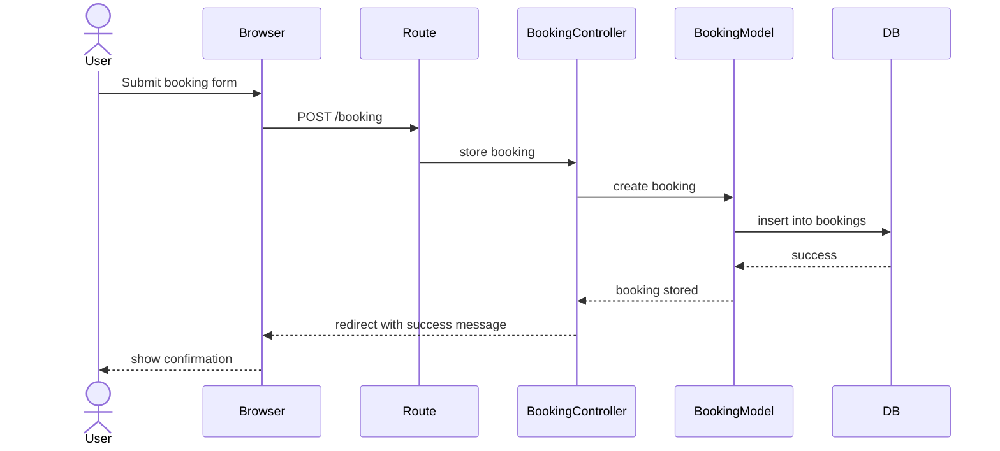

### 5. Admin Update Order Status Sequence

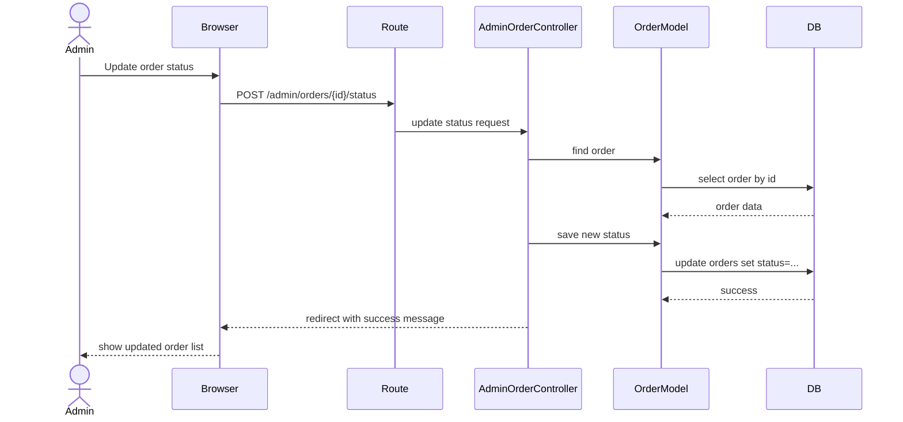

---

## Deep System Flows

### 1. Deep Product Display Flow

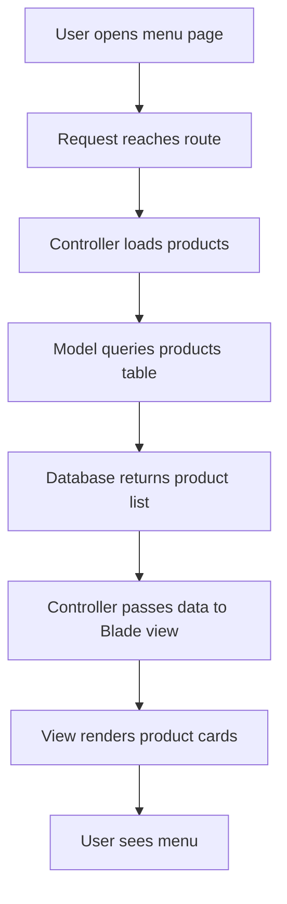

### 2. Deep Product Detail and Size Selection Flow

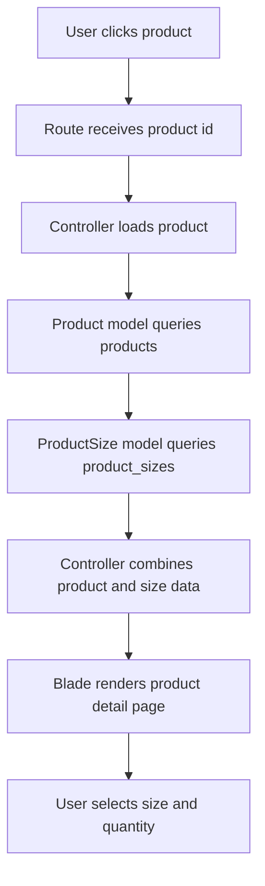

### 3. Deep Add to Cart Flow

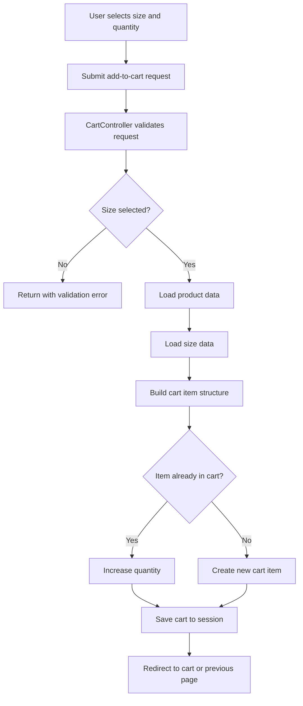

### 4. Deep Checkout Flow

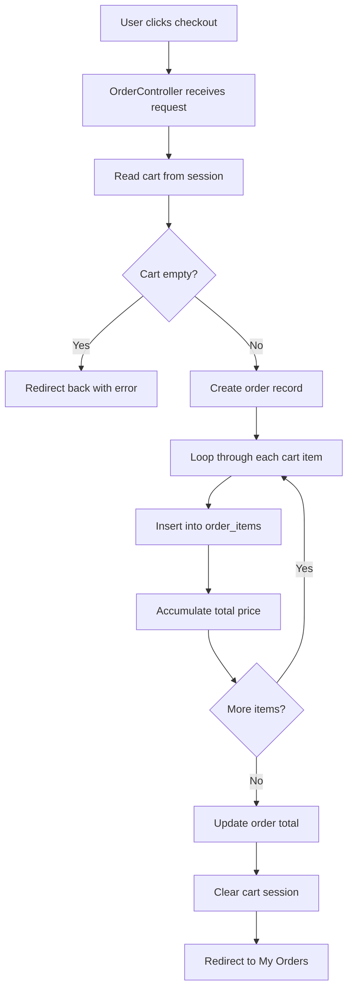

### 5. Deep Booking Flow

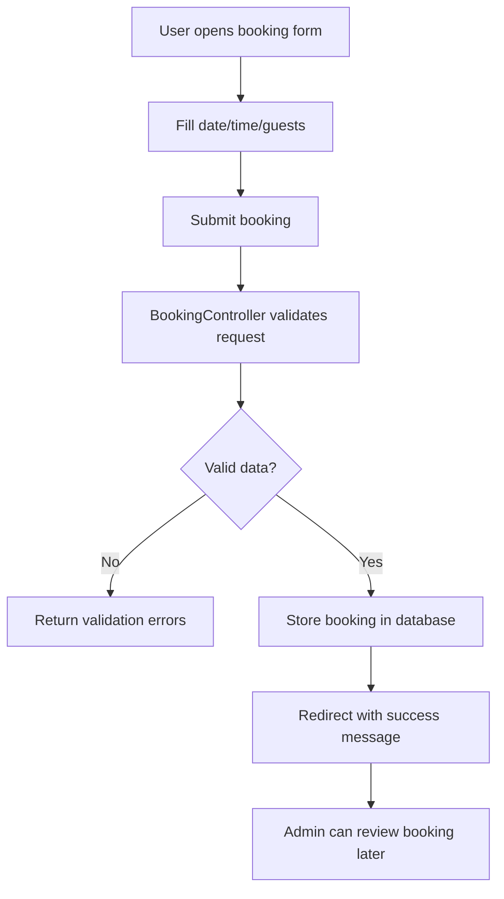

### 6. Deep Admin Product Management Flow

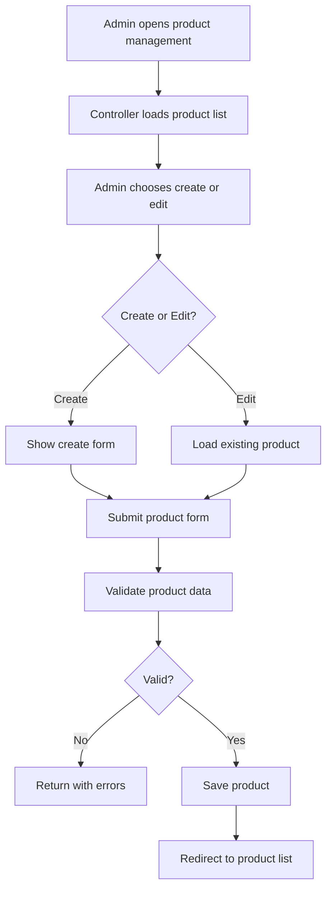

### 7. Deep Admin Order Management Flow

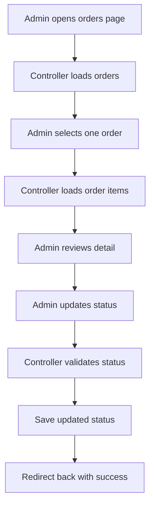

---

## Project Structure

A typical project structure for Aurelia Coffee may look like this:

```text
aurelia-coffee/
├── app/
│   ├── Http/
│   │   ├── Controllers/
│   │   │   ├── AdminController.php
│   │   │   ├── ProductController.php
│   │   │   ├── CartController.php
│   │   │   ├── OrderController.php
│   │   │   ├── BookingController.php
│   │   │   └── ContactController.php
│   ├── Models/
│   │   ├── User.php
│   │   ├── Admin.php
│   │   ├── Product.php
│   │   ├── ProductSize.php
│   │   ├── Order.php
│   │   ├── OrderItem.php
│   │   ├── Booking.php
│   │   └── Contact.php
├── bootstrap/
├── config/
├── database/
│   ├── migrations/
│   └── seeders/
├── public/
│   ├── images/
│   ├── css/
│   └── js/
├── resources/
│   ├── views/
│   │   ├── layouts/
│   │   ├── admin/
│   │   ├── products/
│   │   ├── orders/
│   │   ├── bookings/
│   │   └── auth/
│   ├── css/
│   └── js/
├── routes/
│   └── web.php
├── storage/
├── tests/
├── .env
├── artisan
├── composer.json
├── package.json
└── README.md
```

---

## Installation Guide

### Requirements

Before running the project, make sure your environment includes:

* PHP 8.1 or above
* Composer
* Node.js and npm
* MySQL
* Laravel-compatible local server environment such as XAMPP, Laragon, or built-in Artisan server

### Step 1: Clone the project

```bash
git clone https://github.com/your-username/aurelia-coffee.git
cd aurelia-coffee
```

### Step 2: Install PHP dependencies

```bash
composer install
```

### Step 3: Install frontend dependencies

```bash
npm install
```

### Step 4: Create environment file

```bash
cp .env.example .env
```

### Step 5: Generate application key

```bash
php artisan key:generate
```

### Step 6: Configure database

Edit `.env`:

```env
APP_NAME="Aurelia Coffee"
APP_ENV=local
APP_KEY=
APP_DEBUG=true
APP_URL=http://127.0.0.1:8000

DB_CONNECTION=mysql
DB_HOST=127.0.0.1
DB_PORT=3306
DB_DATABASE=aurelia_coffee
DB_USERNAME=root
DB_PASSWORD=
```

### Step 7: Run migrations

```bash
php artisan migrate
```

### Step 8: Run development assets

```bash
npm run dev
```

### Step 9: Start Laravel server

```bash
php artisan serve
```

### Step 10: Open in browser

```text
http://127.0.0.1:8000
```

---

## Local Development Workflow

A recommended local development workflow is:

1. start MySQL service
2. open project folder in VS Code
3. run `composer install` if dependencies are missing
4. run `npm install` if frontend dependencies are missing
5. run `npm run dev`
6. run `php artisan serve`
7. test user flows and admin flows in browser

---

## Testing Checklist

### Customer Testing

* user can register
* user can log in
* menu page loads products
* product detail shows sizes
* add to cart works
* cart update works
* remove item works
* checkout creates order
* order history displays correctly
* booking submission works
* contact submission works

### Admin Testing

* admin can log in
* admin dashboard loads
* admin can add product
* admin can edit product
* admin can delete product
* admin can manage sizes
* admin can view orders
* admin can update order status
* admin can view bookings
* admin can view contacts

### Database Testing

* orders are saved correctly
* order_items are linked correctly
* bookings are stored
* contacts are stored
* foreign keys are respected

---

## Known Limitations

Depending on the current implementation, the project may still have some limitations:

* payment gateway may not be integrated yet
* role management may be basic
* email notification may not be implemented
* stock management may not be included
* booking conflict detection may be simple or absent
* analytics dashboard may still be basic
* cart may rely only on session

These limitations are normal for an academic or portfolio project and can be improved in future versions.

---

## Future Improvements

The project can be extended with:

1. online payment integration
2. real-time order tracking
3. email notifications
4. SMS or push notifications
5. role-based authorization with policies
6. sales analytics dashboard
7. inventory management
8. coupon or discount system
9. favorite products
10. review and rating system
11. mobile app integration
12. REST API for Flutter or React Native
13. booking slot conflict prevention
14. customer profile management
15. admin reporting export to Excel/PDF

---

## Conclusion

Aurelia Coffee is a complete Laravel-based coffee shop management system that demonstrates real full-stack development concepts. The project includes customer interaction features such as menu browsing, size selection, cart handling, checkout, booking, and contact messaging, while also including administrator functions such as dashboard monitoring, product management, size management, order management, booking control, and message review.

From a technical perspective, the project applies:

* MVC architecture
* routing and controllers
* Eloquent ORM
* relational database design
* session management
* form validation
* role-based separation between customer and admin areas

From a business perspective, the project represents a realistic coffee shop workflow and can serve as a strong graduation project, portfolio project, or foundation for future expansion.

---

## Suggested README Add-ons

You can place the generated diagram images inside a `docs/` folder and embed them like this:

```md
## ERD


## Use Case Diagram


## System Flow

```

### You can also embed Mermaid directly in README:

````md
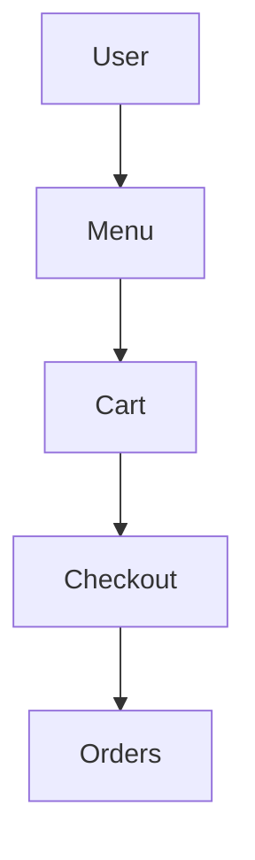

That makes the GitHub README look more professional and technical.

---
```
